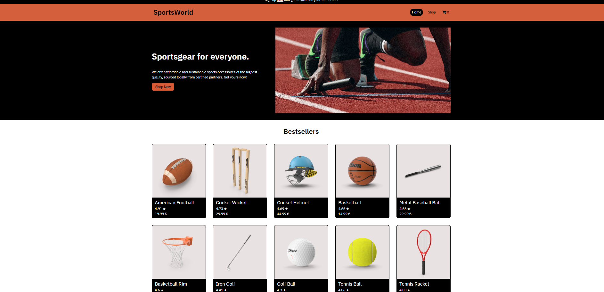

# Shopping-Cart

A responsive React shopping cart app for browsing sports accessories, viewing product details, and managing cart quantities.

## About This Project

This project was built as part of [The Odin Project](https://www.theodinproject.com/lessons/node-path-react-new-shopping-cart) React curriculum.

## What I Learned

Through this project, I learned how to build a multi-page React application with dynamic routing, shared state through nested route outlets, and API-driven product data. I also learned how to test React components in isolation by mocking surrounding components and data. In addition, I gained a much stronger understanding of accessibility from both a user and testing perspective, since primary React Testing Library queries (such as getByRole) rely on accessible semantics. I now see accessibility as a core part of both UI quality and testability, and I plan to apply it more deliberately in future projects.

## Technologies and Tools Used

- HTML5
- CSS3
- JavaScript (ES6+)
- TypeScript
- React
- React Router
- Vite
- ESLint
- Git
- Vercel
- Font Awesome
- DummyJSON API
- React Testing Library
- Vitest
- GitHub Actions
- SonarQube
- @testing-library/user-event
- @testing-library/jest-dom

## Getting Started

1. Clone the repository
2. Install dependencies:
   - `npm install`
3. Start the development server:
   - `npm run dev`

## Run Tests

1. `npm run test`

## Live Demo

- Vercel: https://shopping-cart-alpha-gray.vercel.app/

## Screenshot

## Resources

### API

- https://dummyjson.com/docs/products

### Images

- https://unsplash.com/photos/man-on-running-field-9HI8UJMSdZA

### Icons

- https://fontawesome.com/icons/cart-shopping?f=classic&s=solid
- https://fontawesome.com/icons/trash?f=classic&s=solid
- https://fontawesome.com/icons/x-twitter?f=brands&s=solid
- https://fontawesome.com/icons/instagram?f=brands&s=solid
- https://fontawesome.com/icons/facebook-f?f=brands&s=solid
